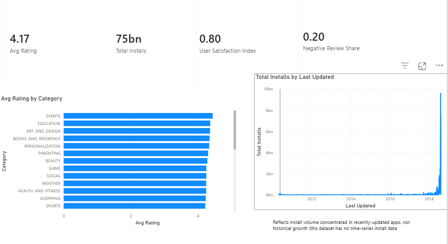
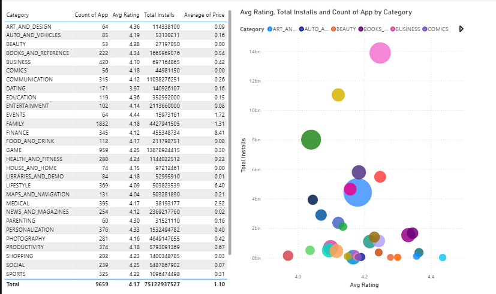
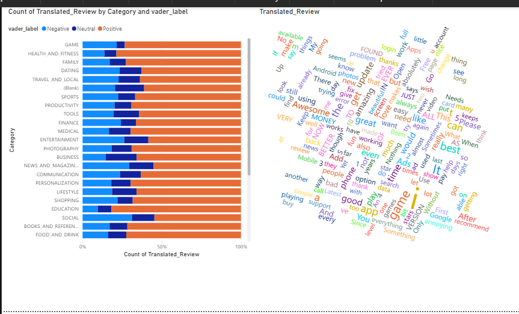
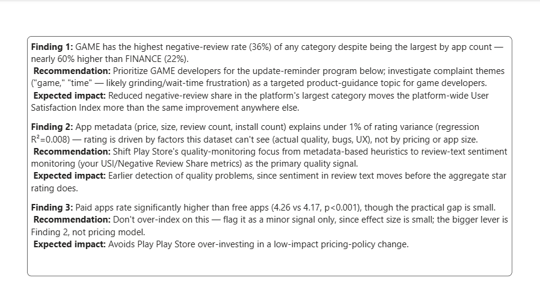

# Google Play Store Product Intelligence Platform

*An end-to-end product analytics case study using Python, SQL, Statistics, BigQuery, Power BI & Looker Studio.*

**The business problem this project answers:** the Google Play team wants to
understand why some apps succeed while others fail, and to find data-backed
opportunities that improve both user satisfaction and developer success.
This project builds the analytics pipeline to answer that from raw data to
an interactive dashboard to prioritized business recommendations.

📄 **[Full Business Report](documentation/business_report.md)** 
📋 **[Business Requirements Document](documentation/BRD.md)**

---

## Architecture

```
Raw Data (Google Play Store Apps + User Reviews)
        │
        ▼
Data Cleaning (Python / pandas)
        │
        ▼
Exploratory Data Analysis
        │
        ▼
BigQuery Warehouse  ──►  25 SQL Analytical Queries
        │
        ▼
Statistical Testing (hypothesis tests, correlation, regression)
        │
        ▼
NLP (VADER sentiment analysis, complaint keyword extraction)
        │
        ▼
Product Metrics Framework (North Star / Supporting / Guardrail)
        │
        ▼
Dashboards (Power BI + Looker Studio)
        │
        ▼
Business Report & Recommendations
```

## Key Findings (see [full report](documentation/business_report.md) for details)

1. **App metadata barely predicts rating** - price, size, install count, and
   review count together explain under 1% of rating variance (R²=0.008).
   Review *text* sentiment is a far more informative quality signal.
2. **GAME is the platform's highest-risk category at scale** - the largest
   category by app count (959 apps) also has the highest negative-review
   rate (36%), nearly 60% above FINANCE (22%).
3. **Paid apps rate modestly but significantly higher than free apps**
   (4.26 vs. 4.17, p<0.001) - a real but minor signal.

## Dashboard Preview

**Executive Summary**


**Category Analysis**


**Sentiment Analysis**


**Recommendations**


## Repository Structure

```
google-play-analytics/
├── raw_data/              # Original, unmodified source CSVs
├── clean_data/             # Cleaned datasets after Python processing
├── notebooks/              # Cleaning, EDA, statistics, NLP notebooks (Colab)
├── sql/                    # 25 BigQuery analytical queries
├── statistics/             # Hypothesis testing & regression notes
├── nlp/                    # Sentiment analysis & keyword extraction
├── dashboards/             # Power BI theme file, dashboard exports
├── documentation/          # BRD, data dictionary, metrics framework, business report
├── presentation/           # Slide deck
├── images/                 # Dashboard screenshots for this README
└── requirements.txt
```

## Tech Stack

| Area | Tool |
|---|---|
| Language | Python |
| SQL / Warehouse | Google BigQuery |
| Notebook | Jupyter (Google Colab) |
| Data Cleaning | pandas, NumPy |
| Statistics | SciPy, statsmodels |
| Visualization | Matplotlib, Seaborn |
| NLP | VADER (vaderSentiment) |
| Dashboards | Power BI, Looker Studio |
| Version Control | Git + GitHub |

## Data Sources

Google Play Store Apps (10,841 apps, 13 attributes) and Google Play User
Reviews (64,296 reviews with sentiment). Full column-level documentation in
the [data dictionary](documentation/data_dictionary.md), including known
data quality issues and how each was resolved.

## Limitations

Installs are bucketed estimates, not exact counts; there is no real revenue
or developer-identifier field, so several metrics are clearly-labeled
proxies. Full limitations discussion in the
[business report](documentation/business_report.md#limitations).

## Author

Mohammed — built as a project on Google Analytics
